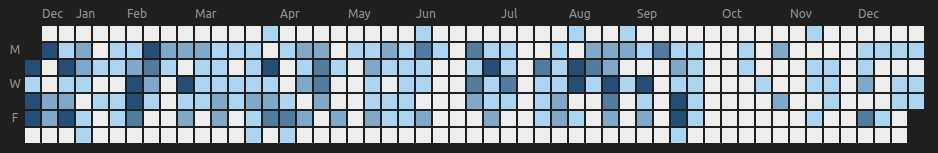

 

  

###

<h1 align="center">Hello👋 Tariel is me!</h1>

###

  

###

<h3 align="left">👩‍💻  About me</h3>

###

I'm a developer who keeps up with trends and prioritizes quality. Always on the lookout for new opportunities for
professional growth, I excel in teamwork and can also make significant individual contributions.
  
My core skills include:
  
<b>Frontend:</b> React, Next.js, TypeScript, Redux (thunk, saga, toolkit), JavaScript (with ES6), React Jquery, HTML, CSS,
Sass-Less, Tailwind, Bootstrap, Firebase,Styled-components, RTK-query, AntDesign, Material-UI, Framer-Motion, React-Spring, Leaflet.
  
<b>Other:</b> Git, Gitlab, Github, Figma, Adobe XD, Photoshop

###

<h3 align="left">🛠 Technologies:</h3>

###

  
                       

  

###

<h3 align="left">🔥  My statistics in GitLub:</h3>

###

  

